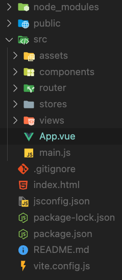

# Vue 흐름
Vue 수업을 계속 들었지만 흐름을 전혀 따라가지 못했다. 컴포넌트가 언제 보여지는지, 어떻게 보이도록 하는지도 모르는 정말 무지한 상태의 연속이었다. 그래서 정리해보기로 했다.

먼저 App이 로딩되면 index.html을 참조한다. 이 때 src="/src/main.js"이기 때문에 main.js를 본다.

```
import { createApp } from 'vue'
import { createPinia } from 'pinia'

import App from './App.vue'
import router from './router'

const app = createApp(App)

app.use(createPinia())
app.use(router)

app.mount('#app')
```
위의 코드는 main.js 코드이다. 순서를 보자.

1. createApp으로 먼저 App을 초기화한다.
2. App.vue에서 App을 import하고 app 변수에 createApp(App)으로 담는다.
3. app을 mount한다.

```
<template>
  <div>
    <HeaderNav />
    <RouterView />
  </div>
</template>

<script setup>
import HeaderNav from "@/components/common/HeaderNav.vue";
</script>

<style></style>
```
위의 코드는 App.vue이다. <HeaderNav />를 통해서 Header를 상단에 표시하고 <RouterView />로 해당 URI에 따라 그에 맞는 Component를 보여준다.

# package.json & package-lock.json


여기에 보면 package-lock.json과 package.json이 있다. 내용을 살펴보면 둘 다 구조도 비슷하고 스프링에서 보던 pom.xml과 비슷하다는 생각이 들었다. 둘이 비슷한데 차이가 뭘지 궁금했다.

먼저 package.json은 프로젝트의 메타데이터와 함께 의존성 관리를 담당하는 파일이다.

package-lock.json은 npm install할 때 생성되며 설치된 모든 패키지의 정확한 버전과 이들 간의 의존성 트리를 기록한다. 

package.json은 설치된 파일의 version range를 보여주지만 package-lock.json은 설치된 패키지들의 정확한 버전을 나타낸다. 그러면 package-lock.json만 있으면 됐지 왜 package.json까지 있어야 할까? 이는 프로젝트의 유연성과 호환성을 유지하기 위함이다. version range를 사용함으로써 패키지의 새 버전이 출 시될 때 마다 전체 프로젝트를 업데이트하지 않고도 자동으로 해당 패키지의 최신 버전을 받아서 사용할 수 있다.